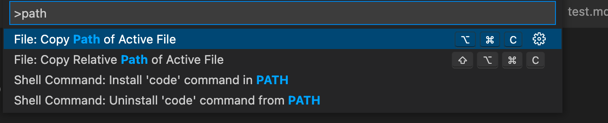

While browsing in the terminal, if you want to open VS Code, It can be launched with the below command. 

To open the current directory
```
code .
```
For this to work, please enable it in the command palette of VS Code first. 
Use Ctrl+Shift+P or Cmd+Shift+P to launch the command palette and search for "path"





Choose the Option "Install 'code' command from PATH" and now you can open any directory directly from terminal. 